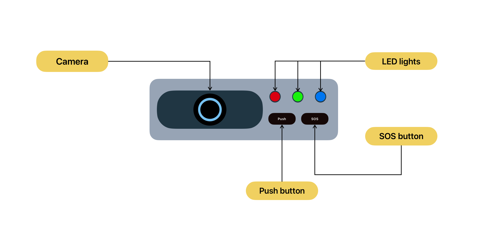
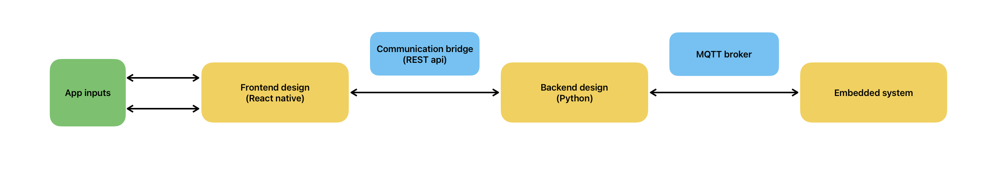
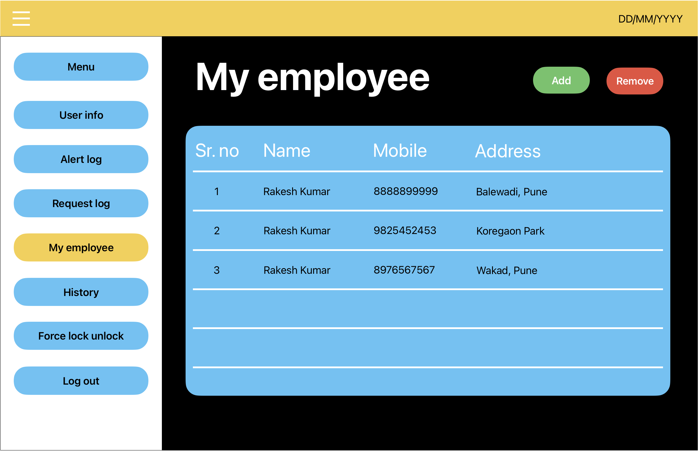

# Biometric Door Lock System

This project implements a secure and user-friendly biometric door lock system for restricted access control. 
We leveraged the machine learning to achieve accurate facial recognition and streamlined access management through mobile and desktop applications.
The door lock device contains a camera it can be a webcam or a 2 MP raspberry pi camera. three LED lights indicating the status of recognition and two buttons "PUSH" and "SOS" 
visitors can press PUSH button to generate a manual request to enter into the premises, if the admin approves the request door opens else remains closed. or press SOS button to generate a alert notifactio to owner of the property in emergency.

## Biometric door lock device 

## LED indicators

## Advanced facial recognition
Employs state-of-the-art deep learning models:
1. MediaPipe for robust face detection in various lighting conditions.
2. MobileFacenet for generating unique facial embeddings that capture a person's distinctive features.
3. Random Forest Classifier for accurate person identification based on the extracted embeddings.

## Seamless Access Control
1. Grants access to authorized personnel upon successful facial recognition, ensuring only authorized individuals can enter restricted areas.
2. Provides a manual button option for unregistered visitors through a button on the biometric device.
3. Sends real-time notifications to administrators regarding manual entry requests, allowing them to grant or deny access remotely.

## Mobile and Desktop App Integration
1. Utilized MQTT protocol to seamlessly communicate facial recognition status with custom-built mobile and desktop applicationn
2. Offers a convenient and intuitive user experience for access management and monitoring.
3. Developed frontend using React Native for a smooth and responsive user interface
4. Developed backend Python with Django for robust server-side logic and database management
5. Used REST API for frontend and backend communication

## User Interface
1. menu bar at the top contains options like "User info", "Alert log", "Request log", "My employee" etc which can be used by the admin.
2. User info displays information about the currently logged-in admin.
3. Alert log and Request log contains the information about access attempts, lock/unlock events, or manual entry requests.
4. My Employee tab shows a list of employees with their names, mobile numbers, and addresses and this page is also used to manage employees by adding or removing the employee credentials
5. History this section shows a history of access events or lock/unlock actions.
6. Force lock/unlock button allows an admin to manually lock or unlock the door.
7. Log out which allows the current user to log out of the application.

## Results
We used advanced machine learning models to perform facial recognition and interfaces a electromagnetic door lock with a raspberry pi, 
based on the recognition status of the person the door either opens or remains closed and the status of recognition is communicated to the server 
seamlessly using MQTT protocol. All important information is dispayed in a user application which helped in dsteamlining access management 
for administrators and provides convinient user experience with mobile and desktop app integration.
